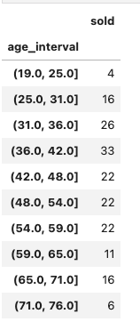
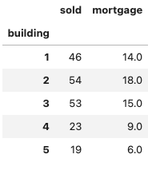
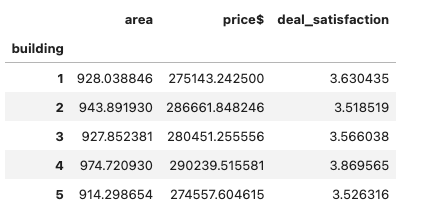
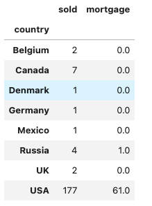
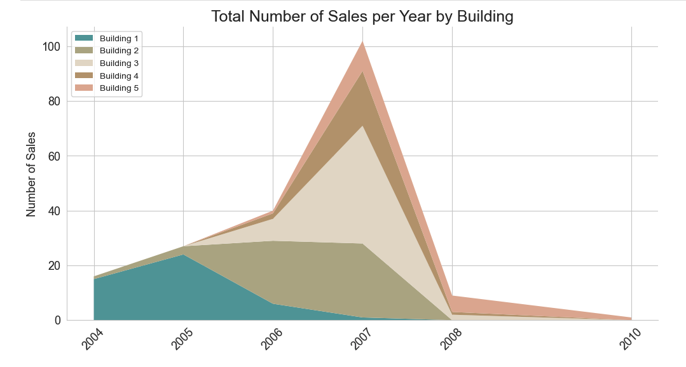
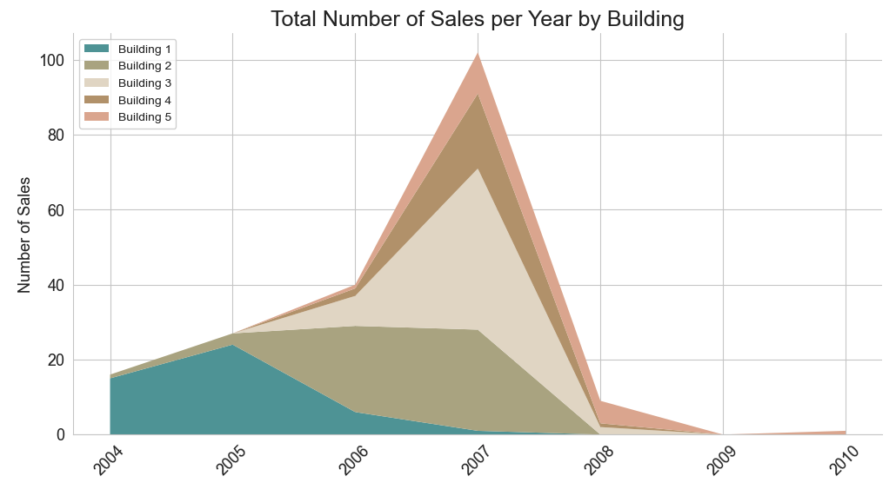

# Real Estate Market Analysis

## Data Source

The data in this Real Estate Market Analysis with Python project includes two .csv files, divided into two main tables. 
1. The first dataset contains details about the properties, including ID, building details, sale date, etc.
2. The second dataset comprises customer details, such as customer ID, entity, name, surname, etc.

# Approach

## Master Data Management (MDM)
As part of our commitment to ensuring high data quality and consistency, we have incorporated Master Data Management (MDM) principles into our project. This involves comprehensive data profiling, cleaning, standardization, and integration to create a unified dataset that is reliable and ready for advanced analysis.

## Part 1: Data Processing

### Data Cleaning and Standardization 

The preprocessing step in this project involves
- cleaning the `Properties` Dataset by:
    - creating a copy of the original dataset: this safeguards the raw data incase there are accidental modifications made. We make use of the copy instead
    - Dataset overview: generate a summary of the contents of our real estate dataset. The summary covers each column’s count, unique values, and frequency 
    - Evaluate Missing Values: making sure all values in the dataset are present
    - Verifying Data Type: convert the wrong data types to the correct ones for easier analysis
    - Final Verification: verify all columns we need are present as well as the data types have been convered
      
- cleaning the `Customers` Dataset by:
    - Missing values: check for missing values and replace with NA where necessary
    - Standardising data: ensure there are only lowercase for the necessary values, ensuring easier analysis
    - Verify data types: convert the wrong data types to the correct ones for easier analysis

- Merging the two datasets
    - merge the cleaned **Properties** and **Customer** datasets

### Data Profiling and Initial Analysis
Detailed data profiling is conducted to identify key data quality issues. Comprehensive HTML reports were generated using pandas-profiling, providing insights into missing values, duplicate records, data types, and value distributions. These reports are available in the repository:

1. [Properties Profiling Report](data_profiling_properties_report.ipynb)
2. [Customers Profiling Report](data_profiling_customers_report.ipynb)

### Data Integration
The cleaned datasets were merged to create a unified dataset, resolving any conflicts and ensuring data consistency.

For more detailed steps and insights, please refer to the [project summary report](project_summary.md).

## Part 2: Descriptive Statistics

- Breakdown by Building
  We create a variable named `data` to hold the dataset and display the first five rows for an overview. Using the .describe() method with include=all, we obtain descriptive statistics 
  and set datetime_is_numeric=True to handle DateTime values. Analyzing the data, we find that the building column has five unique options, and by creating a frequency distribution 
  table, we observe that properties in building 4 are larger, more expensive, and have higher customer satisfaction.

- Breakdown by Country
  To create a frequency distribution table for the country, we redefine the columns of interest to include country, sold, and mortgage, and store the grouped data in `
  `totals_by_country`. 
  Noticing two entries for USA due to an extra space, we use the `.strip()` method to clean the text columns for consistency. This allows us to obtain an accurate breakdown of totals 
  and averages

- Breakdown by State
  Continuing our analysis, we focus on breaking down data by state, including state, sold, and mortgage columns. We create `totals_by_state` to store grouped data but encounter missing 
  values in the state series. Verifying that all customers with state values are from the US, we identify a mismatch with `totals_by_country`, indicating foreign customers or incorrect 
  data. We set state values to missing (pd.NA) for non-US customers. After cleaning, we ensure consistency and sort the data by sold values. We add `relative_frequency` and 
  `cumulative_frequency` columns to the sold_by_state data frame for a detailed frequency analysis using pandas’ .cumsum() method

## Part 3: Data Analysis

- Analysing Customer Age
  We calculate `age_at_purchase` by finding the difference between `date_of_sale` and `birth_date`, converting the result to years, and rounding down. After obtaining these values, we 
  compute descriptive statistics (average, standard deviation, minimum, maximum, and percentiles) and explore the difference between population and sample standard deviation. We then 
  create age intervals to analyze property purchases across different age groups, providing insights into customer preferences based on age.

- Analysing Property Prices
  We create price intervals using 10 bins and count the number of properties within each interval. We also determine the number of sold and unsold properties per price interval to 
  understand the distribution and market trends.

- Relationship between Age and Price
  To analyze the relationship between customer age and property prices, we filter the dataset to include only sold properties. We calculate the covariance between age and price using 
  NumPy's .cov() function to reveal the
   extent of their relationship. We then compute the correlation coefficient to further examine this relationship, exploring differences between 
  population and sample correlations and validating our results.

## Part 4: Data Visualisation

1. Deal Satisfaction by Country Chart
2. Age Distribution Histogram
3. Pareto Chart
4. Total Sales per Year Line Chart
5. Total Sales per Year and Building Stacked Area Chart

## Part 5: Data Intepretation and Recommendations

### Customer Profile

**Customer profiles** help real estate owners and developers identify ideal buyers, but the high demand for affordable housing in US and European cities complicates this. Exclusive luxury developments, however, can effectively target potential customers through ads on platforms like Facebook and YouTube. Typically, homebuyers are aged 31 to 42, with those aged 36 to 42 being the most likely due to their financial stability.

The statistical sample consists of only about a hundred customers, so a larger sample is needed for more conclusive results. However, with sufficient data, real estate firms can create an ideal buyer profile to identify and target potential customers through ads on platforms like YouTube, Google, and Facebook.

### Building Characteristics

The second list provides straightforward information about the characteristics of the buildings in our dataset, including:

    - Areas with the most properties sold
    - Sold property prices
    - The time period during which the sales occurred
    
Such property data is widely available and can include detailed information like the floor, orientation, and window style. This allows for the creation of a comprehensive overview of the market and its trends. 

**Interpretation**

#### Breakdown by Building

Based on the data, we can deduce that most of the building are type 2 and 3:

The average price and deal satisfaction shows:

Type 4 properties have the highest average sale prices at $290,000 and the highest average deal satisfaction at 3.9. These buildings also cover the largest area and likely feature more luxurious or spacious apartments. However, they sell less frequently due to their higher cost per square meter. Customers tend to prefer smaller, less expensive types 2 and 3. Real estate developers can use this data to strategize by either focusing on standard building types for more average-priced sales or investing in luxurious apartments to achieve higher deal satisfaction.

#### Sales by Country

The geographical data, shows that 90% of the sales come from the United States:

#### Total Number of Sales per Year by Building

Integrate this information with the timing of sales by examining the stacked area chart of the total number of sales per year by building type.

We observe that 2007 had the highest number of sales, coinciding with the period just before the market crash in the United States. Interestingly, there were no sales recorded in 2009, as highlighted by our line and stacked area charts. This crucial information has been explicitly included in the project's final section.

We can conduct a similar analysis of customers and buildings when we obtain more recent data, allowing us to identify and extract current trends.
